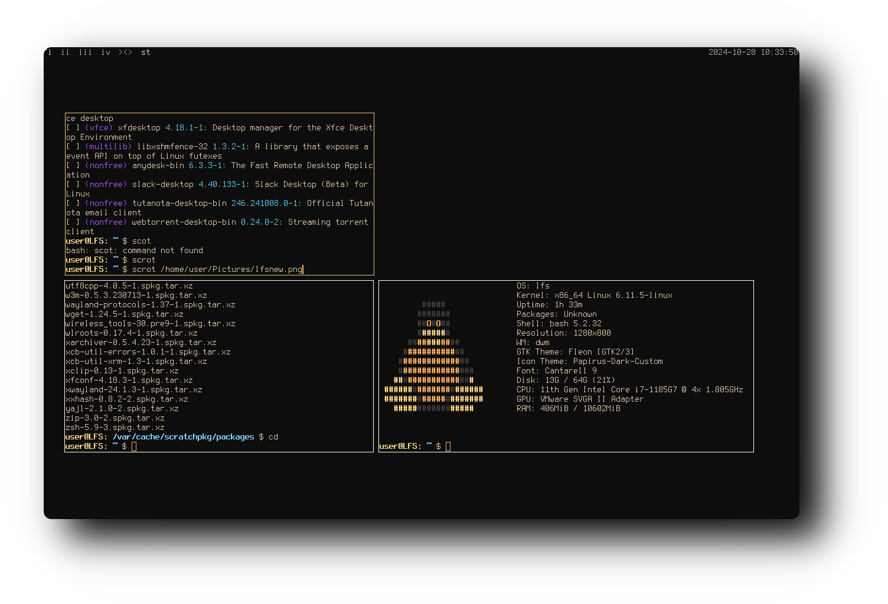

  <h1 style="font-size: 36px; color: #d2691e; text-shadow: 2px 2px 5px rgba(0, 0, 0, 0.3);">
    🌟 <strong>𝐃𝐖𝐌-𝐃𝐎𝐓𝐅𝐈𝐋𝐄𝐒</strong> 🌟
  </h1>

  <h2 style="font-size: 28px; color: #7c3f00; text-shadow: 1px 1px 4px rgba(0, 0, 0, 0.3);">
    🎨 Showcase
  </h2>
  

    Below is a preview of my rice setup, showcasing a minimalist floating window layout with sleek black and dark yellow accents.
  

  

    
    

      Powered by DWM
    

  

---

  

    My custom <strong>dwm</strong> configuration is specifically tailored for 
    <a href="https://www.linuxfromscratch.org/lfs/view/stable/" target="_blank" style="text-decoration: none; color: #d2691e;">
       <strong>Linux From Scratch (LFS) 12.2</strong>
    </a>, prioritizing <strong>performance</strong>, <strong>simplicity</strong>, and a <strong>clean aesthetic</strong>.
  

  

    This configuration is based on the 
    <a href="https://dwm.suckless.org/" target="_blank" style="text-decoration: none; color: #7c3f00;">
       <strong>Suckless DWM Window Manager</strong>
    </a>, emphasizing minimalism and efficiency.
  

---

  <h3 style="font-size: 24px; color: #333; text-align: center;">📥 Installation</h3>
  <pre style="background-color: #2e2e2e; color: #f4f4f4; padding: 15px; border-radius: 8px; font-size: 16px; max-width: 800px; margin: 20px auto; overflow-x: auto;">
git clone https://github.com/user7210unix/dwm-dotfiles.git
cd dwm-dotfiles/suckless
  </pre>

---

  <h3 style="font-size: 24px; color: #7c3f00;">Want to Learn More?</h3>
  

    Check out the official guides for:  
    <a href="https://www.linuxfromscratch.org/lfs/view/stable/" style="color: #d2691e; text-decoration: none; font-weight: bold;" target="_blank">
       Linux From Scratch (LFS)
    </a> 
    and 
    <a href="https://dwm.suckless.org/" style="color: #7c3f00; text-decoration: none; font-weight: bold;" target="_blank">
       Suckless DWM
    </a>.
  

